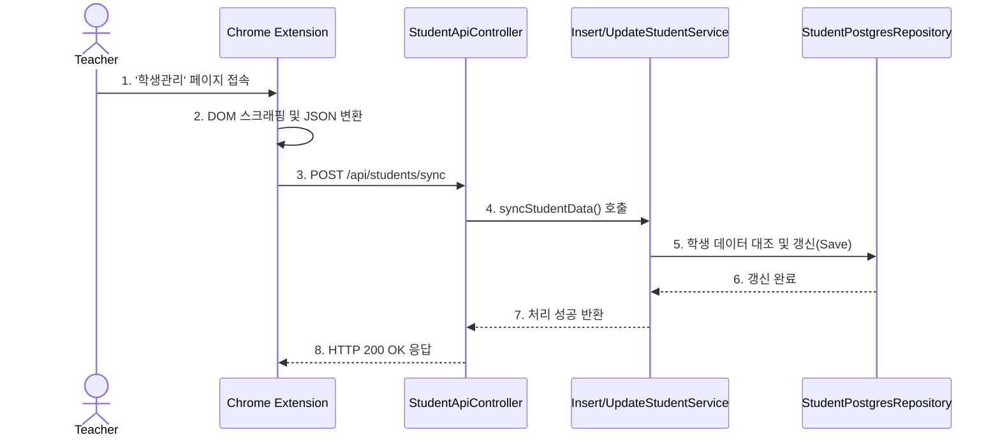
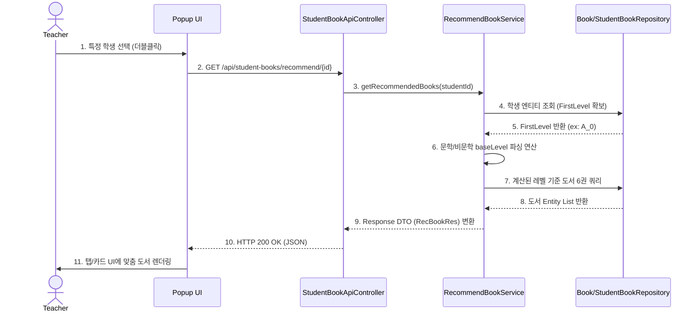
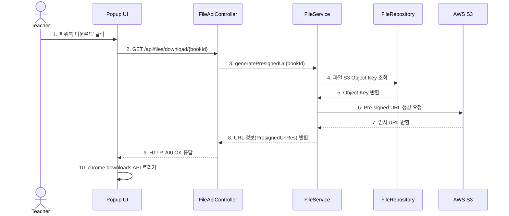
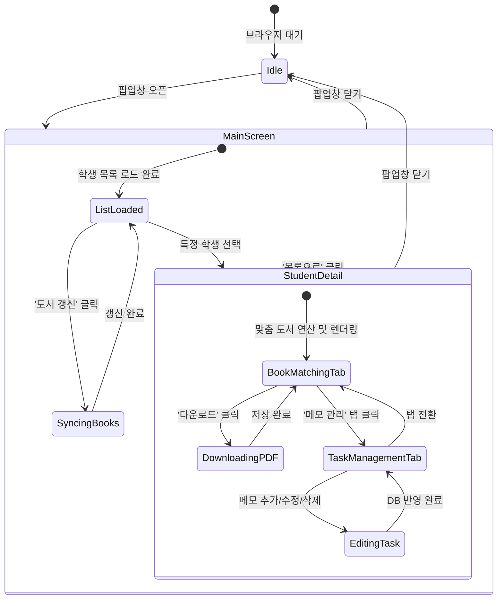

# 티칭오션(Teaching Ocean) 매니지먼트 - Design Document

## [ Revision history ]

| Revision date | Version # | Description | Author |
| :--- | :--- | :--- | :--- |
| 2026-03-27 | 1.0 | First Concept document | |
| 2026-05-05 | 2.0 | 플랫폼 변경(Web ➔ Chrome Extension) 및 기능 변경 | |
| 2026-06-05 | 3.0 | Design document 작성 (Class, Sequence, State Machine) | 최재현 |

 

# 1. Introduction

### 1.1 Summary
평소 '리딩오션' 학원 관리자들은 다수의 학생을 관리하고 맞춤형 독후 활동을 제공하기 위해 '티칭오션' 웹사이트를 이용합니다. 하지만 잦은 페이지 이동과 복잡한 탐색 과정으로 인해 실제 교육 현장에서는 업무 피로도가 높았습니다. 이러한 불편함을 해소하고, 관리자의 개인 노트북 환경에서 빠르고 직관적으로 학생 관리를 수행할 수 있도록 고안된 시스템이 바로 '티칭오션 매니지먼트(Teaching Ocean Management)' 크롬 확장 프로그램입니다. 본 문서는 Analysis 단계에 이은 Design 단계의 문서로, 시스템 구현을 위한 실질적인 클래스 설계, 시퀀스 다이어그램, 상태 머신 다이어그램을 정의합니다.

### 1.2 Features of "Teaching Ocean Management"
티칭오션 매니지먼트는 개인 노트북에서 구동되는 확장 프로그램으로, 별도의 로그인 절차 없이 즉시 동작합니다. 교사는 브라우저 팝업창 하나에서 모든 핵심 업무를 처리할 수 있습니다. 현재 접속 중인 웹페이지의 데이터를 바탕으로 학생 정보를 백그라운드에서 자동 동기화하며, 학생의 현재 독서 레벨을 기준으로 시스템에 정의된 규칙에 따라 다음 도서를 빠르고 정확하게 산출해 냅니다. 

### 1.3 Goals
이번 Design 보고서에서는 티칭오션 매니지먼트의 백엔드(Spring Boot)와 프론트엔드(Chrome Extension) 간의 상호작용을 구현하기 위한 구체적인 Class Diagram을 설계합니다. 또한, Use case에 대한 Sequence Diagram을 그려 데이터의 동적 흐름을 모델링하고, 확장 프로그램의 라이프사이클을 보여주는 State Machine Diagram을 통해 시스템이 가질 수 있는 모든 상태를 정의합니다. 이를 통해 실제 개발(Implementation) 단계에서의 명확한 청사진을 제공하는 것이 목표입니다.

 

# 2. Class Diagram

본 프로젝트는 클라이언트(Chrome Extension)와 서버(Spring Boot 기반 REST API) 구조로 이루어져 있습니다. 캡처된 실제 프로젝트 구조를 바탕으로 **Entity(Model)** 계층과 비즈니스 로직을 처리하는 **Controller/Service** 계층을 중심으로 설계하였습니다.

### 2.1 Entity (데이터 모델)

| 클래스명 | 역할 및 매핑 정보 |
| :--- | :--- |
| **`StudentEntity`** | DB의 학생 테이블과 매핑되며, 동기화된 원생의 핵심 정보(이름, 기준 레벨 등)를 담습니다. |
| **`BookEntity`** | DB의 도서 테이블과 매핑되며, 대량 삽입(Bulk Insert)되는 전체 도서 정보를 관리합니다. |
| **`StudentBookEntity`** | 학생(`Student`)과 도서(`Book`) 간의 N:M 관계를 연결하여 독서 진도 및 매칭 상태를 기록합니다. |
| **`TaskEntity`** | 교사가 개별 학생에 대해 작성하는 스케줄 및 상담 메모(마감 기한, 완료 여부 등)를 관리합니다. |
| **`FileEntity`** | 파워북(PDF) 다운로드를 위해 AWS S3 객체 경로 등 파일 메타데이터를 관리합니다. |

### 2.2 Controller & Service (비즈니스 로직)

| 컨트롤러 (API) | 연관 서비스 (Service) | 핵심 역할 |
| :--- | :--- | :--- |
| **`StudentApiController`** | `SelectStudentService` `InsertStudentService` `UpdateStudentService` `DeleteStudentService` | 프론트엔드와 통신하며 학생 데이터의 조회, 동기화, 수정, 삭제 처리를 담당하는 진입점입니다. |
| **`BookApiController`** | `SelectBookService` `InsertBookService` `SearchBookService` `RecommendBookService` | 도서 데이터의 조회, 카테고리별 검색 및 확장 프로그램을 통한 도서 목록 대규모 갱신 처리를 담당합니다. |
| **`StudentBookApiController`** | `SelectReadBookService` `InsertReadBookService` `DeleteReadBookService` `UpdateStudentBook...` | 시스템의 핵심인 학생별 '맞춤 도서 매칭' 알고리즘과 이전/현재/다음 독서 진도율 로직을 전담합니다. |
| **`TaskApiController`** | (Task 관련 CRUD Service) | 학생별 개인 할 일(메모) 등록 및 조회, 기한 만료 알림 처리를 담당합니다. |
| **`FileApiController`** | (File 관련 Service) | AWS S3와 연동하여 파워북 파일(PDF) 다운로드를 위한 Pre-signed URL 생성 및 반환을 담당합니다. |

# 3. Sequence Diagram

### 3.1. UC1: 학생 정보 자동 동기화 (Auto-sync Student Data)
크롬 확장 프로그램이 티칭오션 화면의 학생 데이터를 스크래핑하여 백엔드로 전송하면, 서버는 기존 데이터와 대조 후 신규 등록 또는 업데이트를 수행합니다.

# 5. Implementation Requirements

### 5.1. Software Requirements
* **Frontend (Chrome Extension):**
  * **OS:** Windows 10/11, macOS
  * **Browser:** Google Chrome (Manifest V3 환경)
  * **IDE:** VS Code
* **Backend (Spring Boot REST API):**
  * **Language/Framework:** Java 17 이상, Spring Boot 3.x
  * **Database:** PostgreSQL 16, AWS S3 (파일 스토리지)
  * **IDE:** VS Code

### 5.2. Hardware Requirements
* **CPU:** Intel Core i5 / AMD Ryzen 5 이상
* **Memory (RAM):** 8GB 이상 (브라우저 및 로컬 서버 동시 구동용)
* **Storage:** 256GB 이상 SSD

 

# 6. Glossary
* **티칭오션(Teaching Ocean):** 기존 학원 관리용 원본 웹 플랫폼.
* **파워북 (Powerbook):** 독서 완료 후 제공되는 독후 활동지(고화질 PDF).
* **DOM 스크래핑:** 웹 페이지(HTML) 구조를 파악해 데이터를 백그라운드에서 자동 추출하는 기술.
* **FirstLevel (초기 레벨):** 학생이 등록 시 부여받는 기준 독서 레벨. 맞춤 도서 매칭 로직의 핵심 연산 기준값.
* **Pre-signed URL:** AWS S3에서 특정 시간 동안만 파일 접근 및 다운로드를 허가하는 임시 보안 URL.

 

# 7. References
1. **Google Chrome Developers**, "Chrome Extension Architecture & API Reference"
2. **Amazon Web Services**, "Amazon S3 Documentation (Pre-signed URLs)"
3. **Spring Data JPA**, "Spring Data JPA Reference Documentation"
